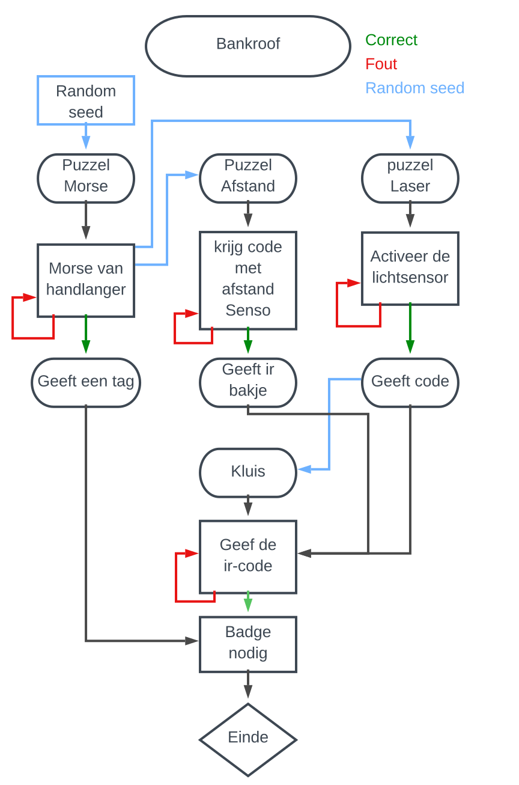

# Hackaton 2022 EscapeRoom: Bankheist

For the course Hackaton we needed to build a group puzzle around the theme EscapeRoom.
We choose to make our EscapeRoom a bankheist and based our puzzles around that.

Read the [Documentation](https://hackaton-documentation.netlify.app/).

